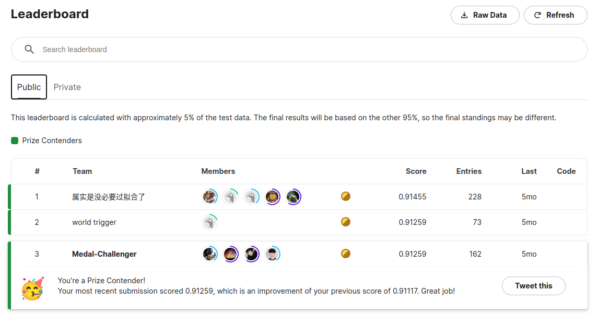
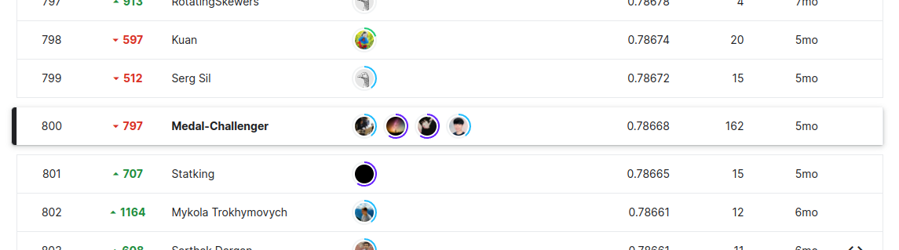

# Jigsaw Rate Severity Of Toxic Comments

<p align="center">
  
</p>


## Members

```
- Kyubin Kim (kimkyu1515@naver.com)
- Jeongwon Kim (kimkim031@naver.com)
- Jaewoo Park (jerife@naver.com)
- Youngmin Paik (ympaik@hotmail.com)
```


## Competition Overview

### Problem
- Score toxicity of a set of comments and rank them
### Dataset
- Ruddit Dataset
- Jigsaw Rate Severity of Toxic Comments
- Toxic-Task
### Due Date
- Team Merge Deadline - 2022/01/31
- Submission Deadline - 2022/02/07

## Result

<p align="center">
  
</p>

- Public leaderboard
> - 3rd of 2301

<p align="center">
  
</p>

- Private leaderboard
> - 800th of 2301

## Program

- Fetch Pretrained Models
```shell
$ sh ./download_pretrained_models.sh
```

- Train
```shell
$ cd /jigsaw-toxic-severity-rating/jigsaw_toxic_severity_rating
$ python3 run_train.py \
          "--config-file", "/jigsaw-toxic-severity-rating/configs/roberta.yaml", \
          "--train", \
          "--training-keyword", "roberta-test"
```

